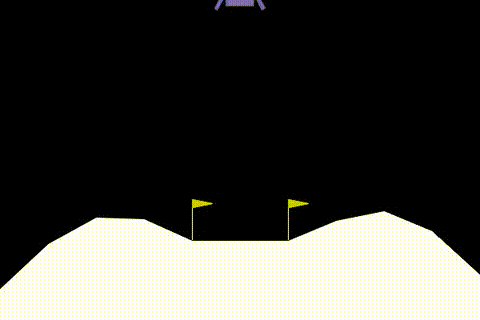
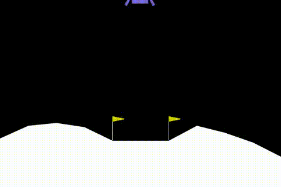
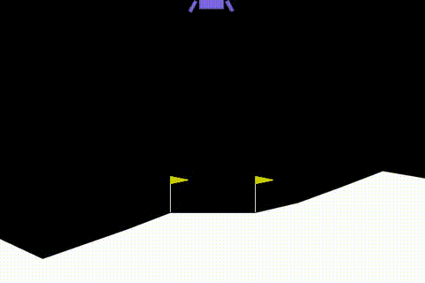
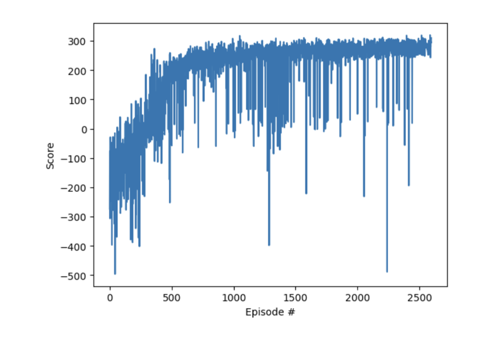

# Lunar Lander RL

This project trains a Deep Q-Network (DQN) agent to play the LunarLander environment using TensorFlow and Keras.

## Demo Gallery

The repository homepage displays the trained agent's behavior at different training stages.

### Episode 500

This GIF shows the agent's behavior after 500 training episodes.

### Episode 1000

This GIF shows the agent's behavior after 1000 training episodes.

### Episode 2000

This GIF shows the agent's behavior after 2000 training episodes.

### Training History

This chart shows how the total reward changes over training episodes.

## Project Files
- [train.py](train.py) — main training script for the DQN agent.
- [utils.py](utils.py) — helper functions for action selection, replay buffer sampling, video generation, and plotting.
- [requirements.txt](requirements.txt) — Python dependencies required to run the project.
- [training_history.png](training_history.png) — training reward curve saved from the experiment.

## Features
- DQN training loop with experience replay
- Compatible environment reset/step handling for modern Gym APIs
- Video and GIF generation plus reward history plotting

## Requirements
Install dependencies with:

```bash
pip install -r requirements.txt
```

## Run training

```bash
python train.py
```

The script will train the agent, save a model file, and generate videos, GIFs, and training plots in the project directory.
